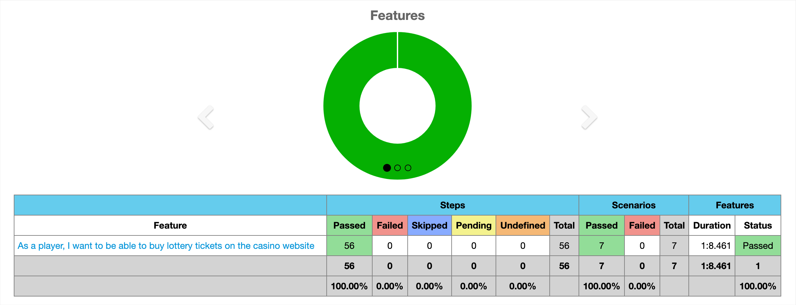

# AutomationBySuleyman

This project is a UI Test Automation suite for the [demo-casino](https://demo.ft-crm.com/).
It is developed in Java using IntelliJ as the IDE

## Tools and Techniques

The project uses the following tools and techniques:

- **Maven**: A build automation tool that is used to manage the project's dependencies and build process.
- **JUnit**: A testing framework that is used to write and run automated tests.
- **Cucumber**: A BDD (Behavior Driven Development) tool that allows tests to be written in a human-readable format.
- **Gherkin**: A language that is used to write Cucumber feature files.
- **Java 11**: The programming language used to write the test code.
- **Selenium WebDriver**: A tool used to automate web browsers.

  
- **OOP Principles**:
This project follows object-oriented programming principles,
which allow for better code organization, encapsulation, and reusability.

- **Page Factory**
In our UI test automation, we have used the Page Factory design pattern, 
which helps us to create an object repository for storing web elements on a web page.
We have used the @FindBy annotation to initialize web elements in our test classes, 
which are then used to perform various actions on the page.

- **Singleton Design Pattern**
We have also used the Singleton design pattern, 
which ensures that there is only one instance of a class throughout the application.This helps us to avoid conflicts 
that can arise when multiple instances of WebDriver are created, 
and ensures that our tests are more stable and predictable.

## How to Run the Tests
- To run the tests, you can use the following command:
- Clone the repository or download the source code.
- Open the project in IntelliJ or your preferred IDE.
- Make sure you have Java 11 installed on your machine.
- To run the tests, you can either use the CukesRunner class by entering tags that include the feature (@registiration, @login, @deposit, @casinogame, @sportsbook, @lotteryticket).
- or run the command mvn clean test in the terminal or Maven tool window within IntelliJ.
- Once the tests have finished, you can view the Cucumber HTML report at "target/cucumber-reports/overview-features.html".

**This will run all the tests and generate a report that can be viewed in the browser.**

## Reports
The test results are presented in the form of a fancy HTML report generated by Cucumber. Here's an example:

## Conclusion
With this project, you can easily test the UI of the demo-casino

The combination of Cucumber and Selenium WebDriver makes it easy to write and run tests,
while the use of Maven simplifies the build process.
